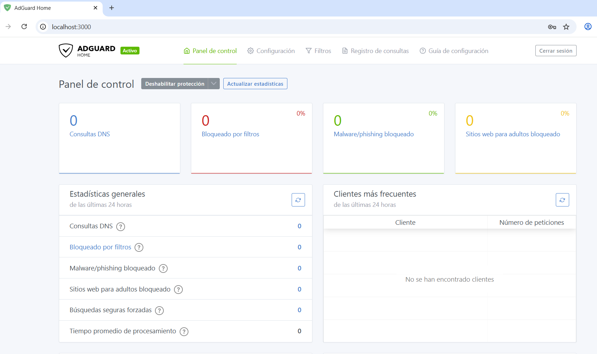
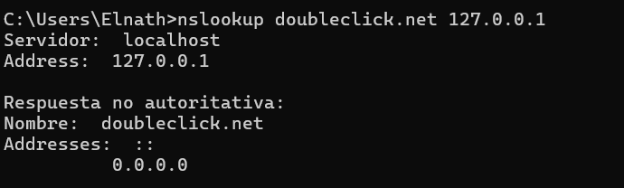
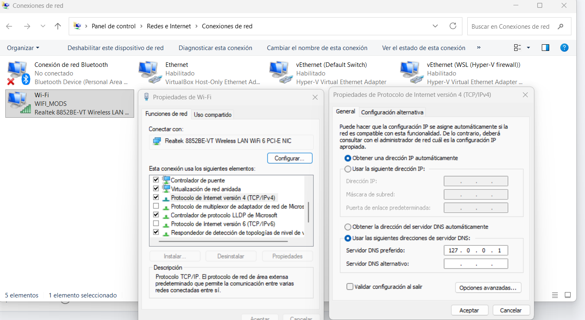

# Pràctica AdGuard Home - Filtratge DNS amb Docker

## 1. Introducció
Aquesta pràctica consisteix en el desplegament i configuració d'**AdGuard Home** utilitzant Docker. AdGuard Home actua com un servidor DNS amb filtratge a nivell de xarxa, permetent bloquejar publicitat, rastrejadors i contingut no desitjat per a tots els dispositius de la xarxa.

## 2. Desplegament amb Docker Compose
S'ha utilitzat un fitxer `docker-compose.yml` per definir el servei. La configuració inclou:
- **Imatge oficial**: `adguard/adguardhome:latest`.
- **Ports exposats**:
  - `53/tcp` i `53/udp`: Servei DNS.
  - `3000/tcp`: Interfície web per a la configuració inicial i el dashboard.
  - `443/tcp` i `443/udp`: HTTPS i DNS-over-HTTPS.
  - `853/tcp`: DNS-over-TLS.
- **Volums persistents**:
  - `./adguardhome/work`: Dades de funcionament.
  - `./adguardhome/conf`: Fitxers de configuració (`AdGuardHome.yaml`).

Per aixecar el servei, cal executar:
```bash
docker compose up -d
```

## 3. Configuració del DNS a la màquina
Perquè el filtratge sigui efectiu, s'ha configurat la màquina local per utilitzar el contenidor com a servidor DNS primari.
- **IP del servidor**: `127.0.0.1` (o la IP de la interfície de xarxa de Docker).
- **Procediment**: S'ha modificat la configuració de xarxa del sistema operatiu per apuntar a aquesta IP en lloc dels DNS per defecte del proveïdor.

## 4. Filtratge i Bloqueig de Dominis
S'han activat les llistes de bloqueig per defecte d'AdGuard (AdGuard DNS filter) i s'ha comprovat el seu funcionament.

### Demostració de bloqueig
Per verificar que el servei funciona correctament, es pot realitzar una consulta DNS d'un domini conegut de publicitat:

```bash
nslookup doubleclick.net 127.0.0.1
```
Si el bloqueig és actiu, la resposta hauria de ser `0.0.0.0`.

## 5. Dashboard i Estadístiques
L'interfície web a `http://localhost:3000` permet visualitzar:
- Total de consultes realitzades.
- Percentatge de consultes bloquejades.
- Top de dominis més consultats i més bloquejats.
- Llista de clients actius.

### Captures de pantalla requerides
A continuació s'han d'adjuntar les captures segons els requisits:

1. **Dashboard**: Captura general de les estadístiques.


2. **Bloqueig**: Demostració que un domini es bloqueja (nslookup).


3. **Bloqueig de Copilot**: Demostració específica del bloqueig del servei Copilot d'Intel·ligència Artificial.


4. **Accés denegat Copilot**: Captura del navegador intentant accedir a Copilot sense èxit.


5. **Configuració DNS**: Captura de la configuració de xarxa de l'equip.



## 6. Decisions Preses
- **Xarxa**: S'ha utilitzat una xarxa tipus `bridge` per aïllar el contenidor però mantenint l'accessibilitat als ports necessaris.
- **Llistes**: S'ha mantingut la llista "AdGuard DNS filter" per la seva alta eficiència i baix índex de falsos positius.

---
*Pràctica realitzada per: Elnath Lavarino*
*Mòdul: 0378 - Tallafocs*
*Institut El Calamot - 2026*
